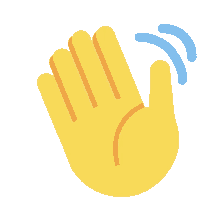
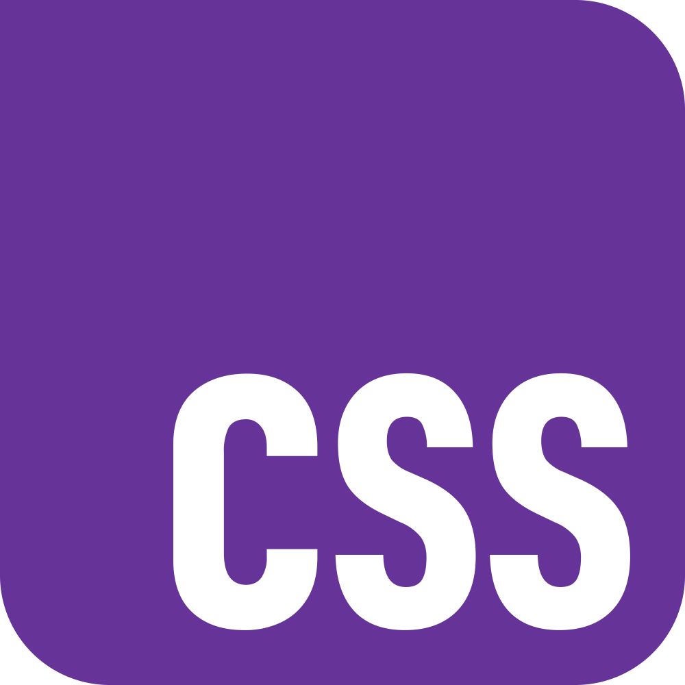
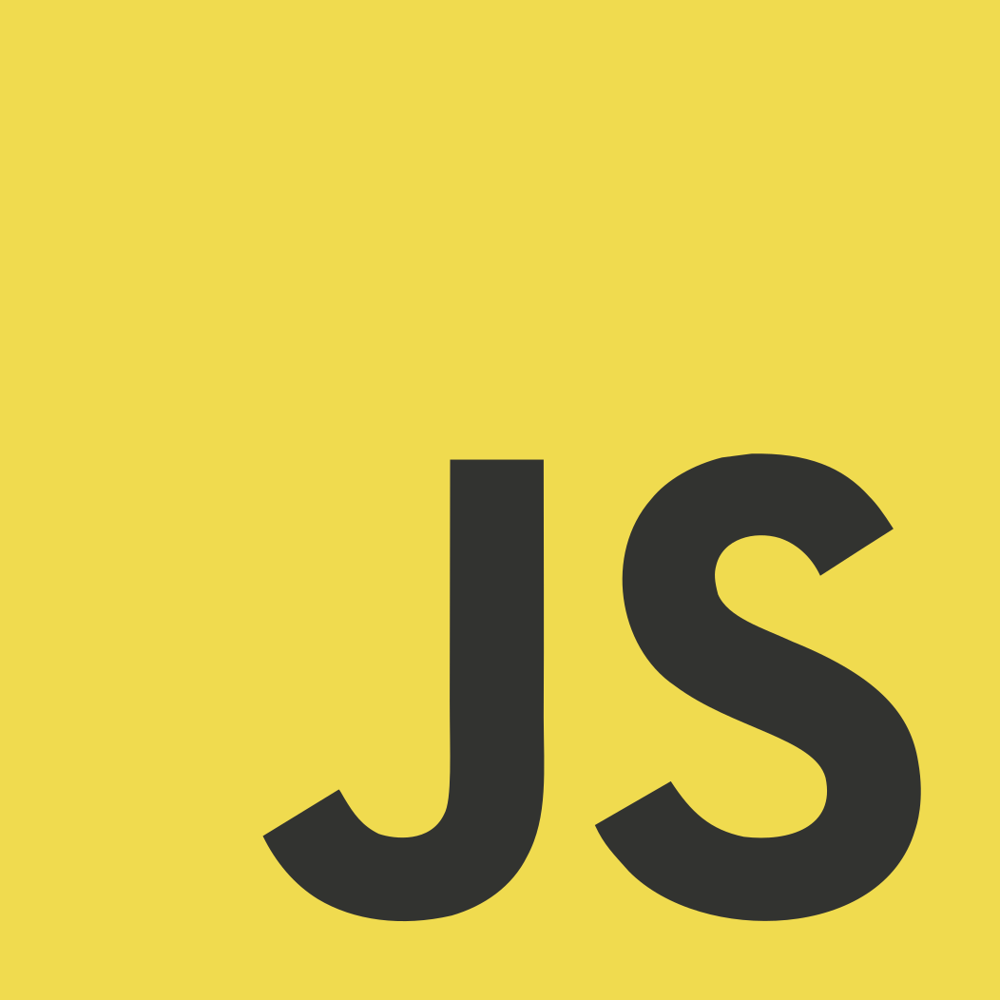
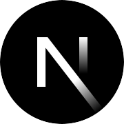
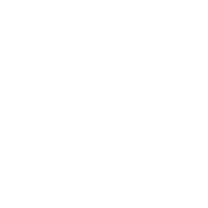
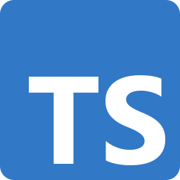
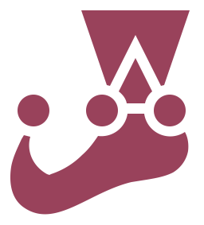

# Oi  me chamo André

Sou desenvolvedor focado no desenvolvimento de backend com TypeScript, utilizando ferramentas como Node.js, Bun e Hono para estruturar microsserviços e APIs estáveis. Por ter experiência prévia como fullstack trabalhando com Next.js, possuo uma visão holística do ecossistema: sei exatamente como o frontend consome os dados, o que me permite projetar rotas mais eficientes, seguras e com excelente documentação.

Escrevo código limpo e modular, focado em facilitar a manutenção e a escala do software. Entendo que o amadurecimento técnico vem com o contexto de produto e colaboração, por isso priorizo a consistência nas entregas, o aprendizado contínuo com o time e a construção de soluções que resolvam desafios de engenharia sem complexidade desnecessária. 

## Minha Stack
Não é uma lista de tudo que já usei, são as que mais pesam no que entrego hoje. Fora delas entram outras conforme o problema e sigo aprendendo o que fizer sentido em cada projeto.  

Passe o mouse por cima para ver o nome das tecnologias

### Frontend

  
  &nbsp;&nbsp;
  
  &nbsp;&nbsp;
  
  &nbsp;&nbsp;
  
  &nbsp;&nbsp;
  
  &nbsp;&nbsp;
  
  &nbsp;&nbsp;
  
  &nbsp;&nbsp;
  
  &nbsp;&nbsp;
  
  &nbsp;&nbsp;

### Backend

  
  &nbsp;&nbsp;
  
  &nbsp;&nbsp;
  
  &nbsp;&nbsp;
  
  &nbsp;&nbsp;
  
  &nbsp;&nbsp;
  
  &nbsp;&nbsp;
  
  &nbsp;&nbsp;
  
  &nbsp;&nbsp;

### Devops

  
  &nbsp;&nbsp;
  
  &nbsp;&nbsp;
  
  &nbsp;&nbsp;
  
  &nbsp;&nbsp;
  
  &nbsp;&nbsp;
  
  &nbsp;&nbsp;
  
  &nbsp;&nbsp;
  
  &nbsp;&nbsp;

## Projetos em destaque

| Projeto | Descrição |
|---------|-----------|
| [**deploy-talent**](https://github.com/AndreXime/deploy-talent) | ATS multi-tenant com NestJS e Next.js |
| [**ecommerce**](https://github.com/AndreXime/ecommerce) | Loja full-stack com Astro, Hono, PostgreSQL e Redis |
| [**ollama-oracle**](https://github.com/AndreXime/ollama-oracle) | Chatbot com RAG local (Ollama + ChromaDB), API Fastify e UI React |
| [**chat-support**](https://github.com/AndreXime/chat-support) | Atendimento em tempo real com tickets e WebSocket |

## Contato

- **Site:** [andreximenes.xyz](https://andreximenes.xyz)
- **LinkedIn:** [linkedin.com/in/andreximenesdev](https://www.linkedin.com/in/andreximenesdev)
- **E-mail:** [andreximenesa20@gmail.com](mailto:andreximenesa20@gmail.com)
